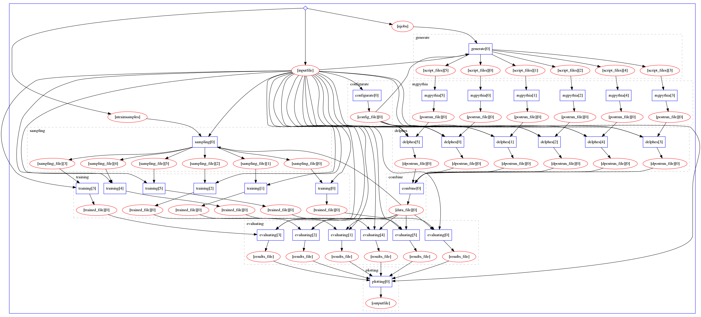

# Madminer workflow


## About
This repository serves as wrapper around [Madminer physics workflow][madminer-workflow-ph]
and [Madminer ML workflow][madminer-workflow-ml] to construct a single, linked workflow
to be executed in [REANA][reana-website].

Both workflows are defined as GIT submodules in this repository. Submodules allow us
to combine contents from different repositories when contents of both are necessary
to perform some complex operation, but they are, indeed, different projects.


## Workflow definition
The workflow specification is composed by 2 sub-workflows:
1. **Physics workflow:** generating events.
2. **ML workflow:** analysing those events.

The combined workflow has this shape:




## Development
To install all the source code that is necessary to operate with this project:

```shell script
git clone --recurse-submodules https://github.com/scailfin/madminer-workflow
```

For cases where the project has already been cloned:

```shell script
git submodule update --init --recursive
```

The repositories defined as sub-modules should will follow their own development pace.
For cases where the sub-module repositories has been updated on GitHub, and want to propagate
those changes to your local copy of the repositories:

```shell script
git submodule update --remote
```


## Execution
The full workflow can be launched using [Yadage][yadage-repo]. Yadage is a YAML specification
language over a set of utilities that are used to coordinate workflows. Please consider that
it can be hard to define Yadage workflows as the [Yadage documentation][yadage-docs] is incomplete.
For learning about Yadage hidden features contact [Lukas Heinrich][lukas-profile], Yadage creator.

Yadage execution depends on having both Docker environment images (_physics_ and _ML_) already published.
If they are not, please follow the instructions on the [Madminer physics workflow][madminer-workflow-ph]
and [Madminer ML workflow][madminer-workflow-ml] repositories.

Once the Docker images are published:
```shell script
pip3 install yadage
make yadage-run
```


## Deployment

### Local deployment
To deploy the workflow locally using [REANA][reana-website], first install _VirtualBox_
as emulator and _Minikube_ as container orchestrator (to simulate a local cluster).
Please refer to **version 0.7.0** of the [REANA deployment documentation][reana-deploy-docs]
for details.

To start the workflow:
```shell script
$ source ~/.virtualenvs/reana/bin/activate
(reana) $ eval $(reana-dev setup-environment)
(reana) $ export REANA_WORKON=madminer-workflow
(reana) $ make reana-deploy
```

### Remote deployment
In case you have access to a remote REANA cluster and want to deploy there,
you would need to setup the environment variables yourself:

```shell script
$ source ~/.virtualenvs/reana/bin/activate
(reana) $ export REANA_ACCESS_TOKEN = [..]
(reana) $ export REANA_SERVER_URL = [..]
(reana) $ export REANA_WORKON=madminer-workflow
(reana) $ make reana-deploy
```

It might take some time to finish depending on the job and the cluster.
Once it does, list and download the files:
```shell script
(reana) $ reana-client ls
(reana) $ reana-client download <path/to/file/on/reana/workon>
```


[lukas-profile]: https://github.com/lukasheinrich
[madminer-workflow-ml]: https://github.com/scailfin/madminer-workflow-ml
[madminer-workflow-ph]: https://github.com/scailfin/madminer-workflow-ph
[reana-deploy-docs]: http://docs.reana.io/development/deploying-locally/
[reana-website]: http://reanahub.io/
[yadage-repo]: https://github.com/yadage/yadage
[yadage-docs]: https://yadage.readthedocs.io/en/latest/
